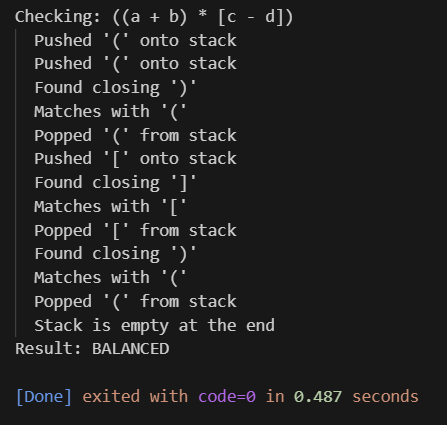

**Question 1**
Write a program to check if any given mathematical expression ha balanced number of
parentheses or not?
Run the program by testing following expression-
⇒a + (b − c) ∗ (d
⇒m + [a − b ∗ (c + d ∗ {m)]
⇒a + (b − c)
Hint: Use stack

**Description**
Following things can be seen in the given program:

1) Read the expression character by character.
2) If an opening bracket is found → push it onto the stack.
3) If a closing bracket is found:
4) Check if the stack is empty → unbalanced.
5) Compare it with the top of the stack.
    If they match → pop the opening bracket.
    If they don’t match → unbalanced.
6) After processing the full expression:
    If the stack is empty → balanced
    Otherwise → unbalanced (some brackets not closed)

**Input/Output**

