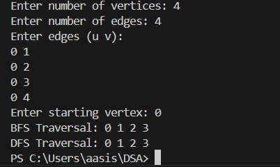

5) How can we implement the undirected graph using adjacency matrix? Write a function that
implement the BFS and DFS technique to traverse through the graph. Demonstrate the
use of your program with example graph.

-> This program follows the concept of Breadth First Search (BFS) and Depth First Search (DFS) traversal of an undirected graph using an adjacency matrix in C.

**Breadth First Search**
 A graph or tree traversal method that vists all nerby nodes first before moving to the next level is called BFS.

 **Depth First Search**
 A traversal method that explore a graph or tree by going deep into a branch before visiting other branches is called DFS.

 Data structure that is used in this program are given below:
 Adjacency Matrix (adj): Keeps track of visited vertices during traversal.
 Queue (array): Used for BFS traversal.
 Recursion: Used for DFS traversal.

 There function used in this program are:
 BFS (int start): visits vertices level by level using a queue.
 Prints the BFS traversal order.

 DFS(int v): uses recursion to explore each branch fully before backtracking and prints the DFS traversal order.

 This program has following applications:
 Graph traversal
 Netwrok analysis
 Path finding
 Understanding BFS and DFS algorithm

 Input/Output

 
 