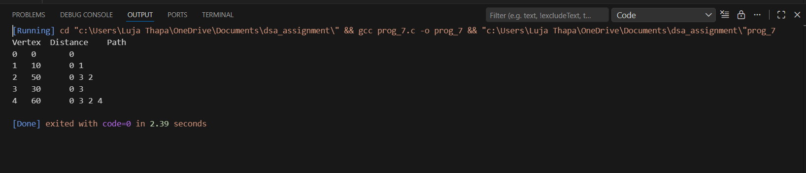

7) Given a weighted graph, implement Dijkstra’s algorithm to find the shortest path from a
source node to all other nodes.

**Description**
This program finds the shortest paths from a given source vertex to all other vertices in a weighted, undirected graph using **Dijkstra's algorithm** . It also pronts the shortest distance and the path for each vertex from the source. 

Functions used in this program are given below:
1) void printPath(int parent[],int j): It recurssively prints the path from the source to vertex j using the parent array. 
2) int findMin(int dist[],int visited[]): Finds prints the unvisited vertex with the smallest distance value.
3) void diskstra(int graph[v][v], int source): This implements Dijkstra's algorithm where,
- It initializes distances and visted vertices
- Iteratively selects the vertex with the minimum distance
- Updates distances of adjacent vertices
- Stores the parent of each vertex to reconstruct the path
- Prints the shoetest distance and path from the source to weach vertex

**Some key points to remember**
It works for non negative weighted graphs 
Uses a simple array to find the minimum distance vertex 
parent[] array is used to reconstruct paths

Input/Output

 
