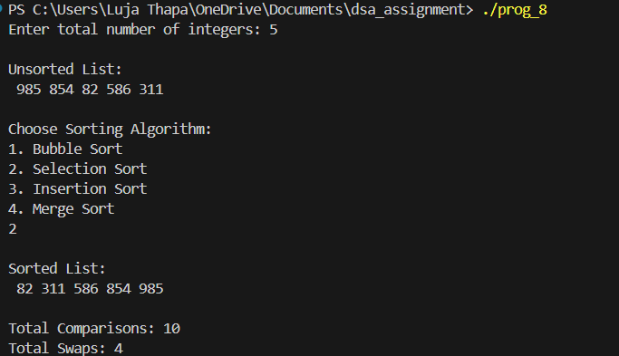

8) 8. Write a program that generates a list of N random integers in the range [1, 1000], where N
is provided by the user at run time. Then, perform the following tasks:
(a) Ask the user to choose a sorting algorithm from the following:
• Bubble Sort
• Selection Sort
• Insertion Sort
• Merge Sort
(b) Sort the randomly generated numbers using the chosen algorithm.
(c) Print the numbers before and after sorting.
(d) Display the total number of comparisons and swaps (if applicable) performed by the
chosen algorithm.

**Description**
This C program generates a lost of random integers and allows the user to sort them using one of 4 sorting algorithms:

Bubble sort- It's a simple comparison based sorting algorithm in which adjacent elements continues until the wntire array is sorted. The largest elements "bubble up " to end of the array in each pass.

Selection sort- Selection Sort is a comparison-based sorting algorithm that divides the array into a sorted and unsorted part.

Insertion sort- Insertion Sort builds the sorted array one element at a time. It picks the next element from the unsorted portion and inserts it into the correct position in the sorted portion, shifting elements as necessary.

Merge sort- Merge sort is a divide and conquer algorithm that divides the array into 2 halves, recursively sorts each half, and then merges the 2 sorted halves into a single sorted array.

The main function works in the following way:
- Promts the user for the number of integers
- Generates a random array of N integers
- Displays the unsorted list
- Prompts the user to choose a sorting algorithm 
- Sorts the array using the selected algorithm
- Displays the sorted list along total comparisions  and total swaps

**Notes**

Bubble Sort, Selection Sort and Insertion Sort count both comparison and swaps.
Merge Sort only counts comparisons; swaps not expicitly counted.
Works for any number of integers within the range [HTML, MAX]

Input/Output

 